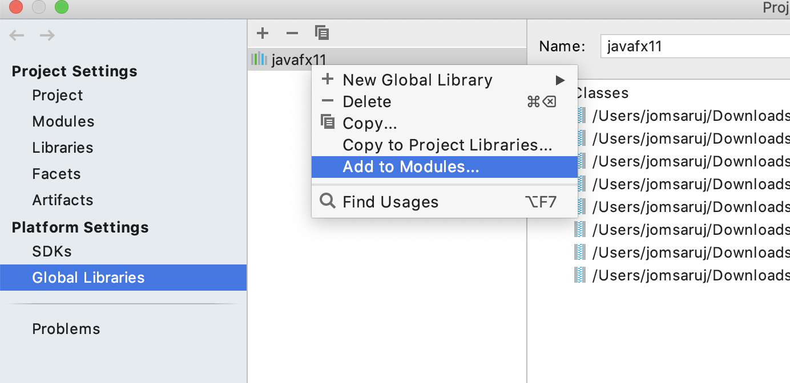
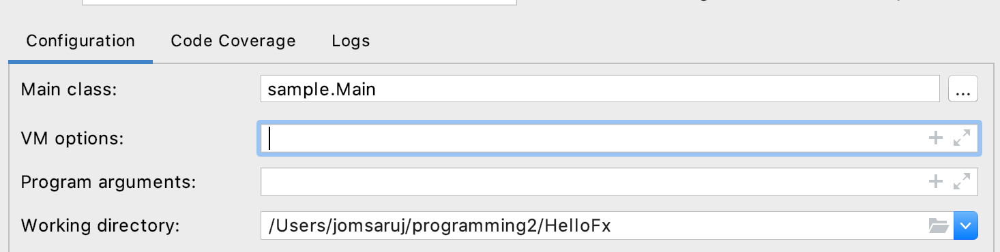
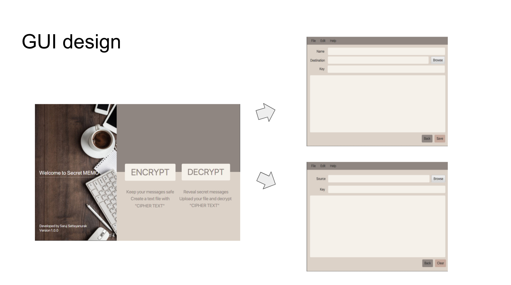
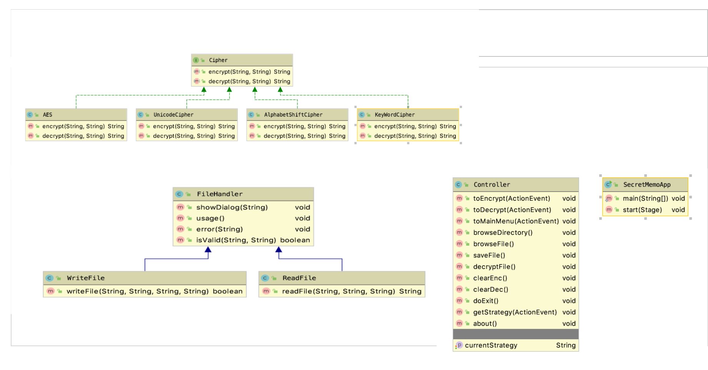

# PA4 - Secret MEMO Application

Secret MEMO is an application that implements knowledge of Cryptography to perform Encryption and Decryption. Which can help to keep you MEMO safe.

## Video 
Explanation video uploaded on Youtube

https://youtu.be/bZstCo34ywM

## Proposal

https://docs.google.com/presentation/d/1Ey6LZhvRqqRmlLksqTXvdDdoCSPlDPeyLEfQgqR243I/edit#slide=id.p

## Run

There are 2 (recommended) ways to run my SecretMEMO Application
* Run secretMEMO application by IDE (recommended Intellij IDEA)
* Run secretMEMO application by command (Terminal)

`Run SecretMEMO application by Intellij`

User can run secretMEMO application by run secretMEMO.SecretMemoApp.java by Intellij IDEA.(For java 11)

* Add javaFX11 to module
    - File -> Project Structure -> Global Libraries -> javaFX11 -> add to modules. -> apply

    

* Add VM option
    - Run -> edit configurations -> VM options
    - --module-path /path/to/javafx-sdk-11.0.2/lib --add-modules javafx.controls,javafx.fxml

    


`Run SecretMEMO application by terminal`

For Java 11 you need to specify the module path for JavaFX. Module paht that are important are javafx.controls and javafx.fxml

```bash
java --module-path /Path to/javafx-sdk-11.0.2/lib/ --add-modules javafx.controls,javafx.fxml  -jar secretMEMO.jar
```

## Design Pattern

Since there are more than one way to perform Encryption and Decryption. Secret MEMO application uses Strategy Design Pattern to provided 4 strategies for user. which are AlphabetShift Strategy, Unicode Strategy, KeyWord Strategy, AES or Advanced Encryption Standard Strategy.

## Overview

**For more details, Please watch the video**



## UML class diagram




